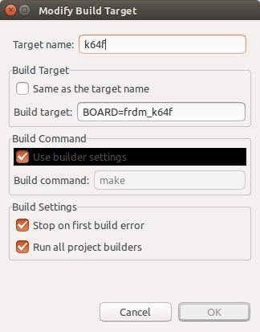
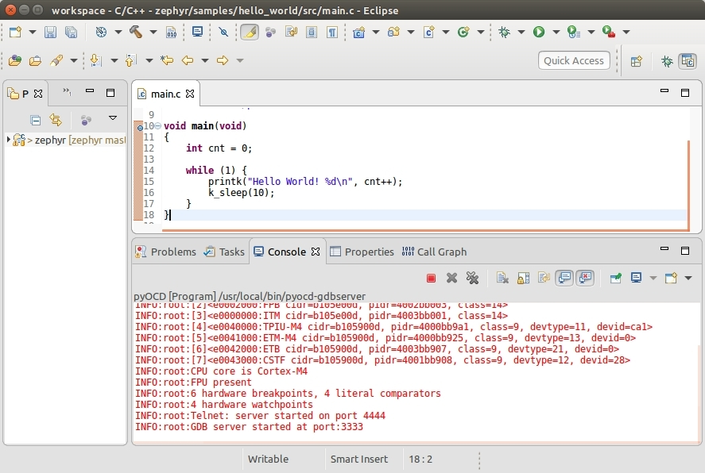
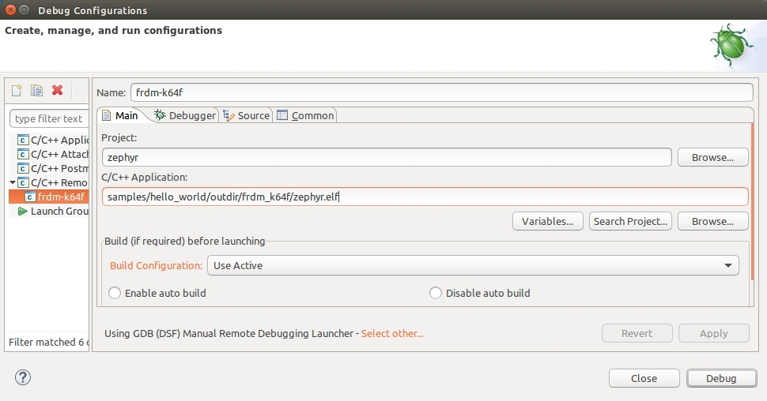
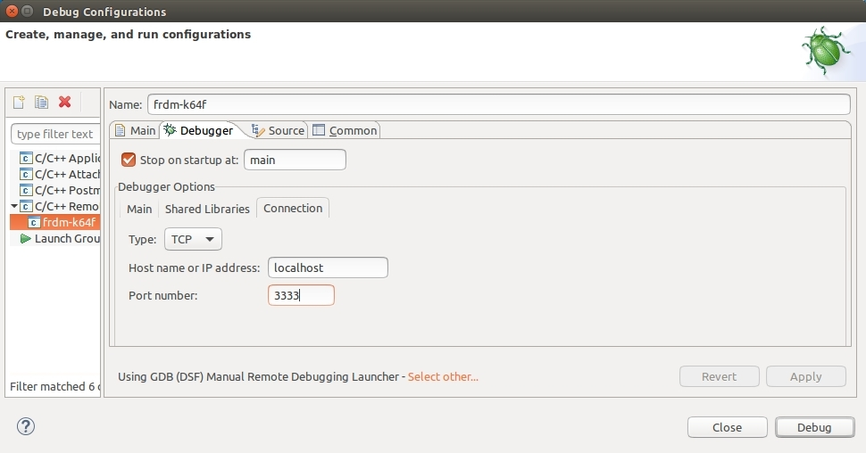

title: FRDM-K64F 单步调试
---

> 作者：[tidyjiang8](http://github.com/tidyjiang8/)


frdm-k64f 是 zephyr 最早支持的两块开发板之一（另一块是 Arduino 101），因此 zephyr 对它的支持已经比较完善了。如果你想学习 Zephyr，又没有合适的开发板的话，这是我向你推荐的开发板之一。

使用 frdm-k64f 的主要好处：

- frdm-k64f 是 Zephyr 官方支持得最好的开发板之一
- frdm-k64f 的烧写、调试都非常方便
- 直接用 frdm-k64f 就能完成大部分基础实验
- 直接用 frdm-k64f 就能完成大部分网络实验(自带以太网卡，但是不能进行 ieee 802.15.4 相关实验)
- 直接用 frdm-k64f 就能完成大部分蓝牙实验
- 直接用 frdm-k64f 就能完成 JavaScript 实验
- 直接用 frdm-k64f 就能完成 MicroPython 实验

> 建议在阅读本文前，先阅读并理解 [QEMU+Eclipse+Ubuntu 进行单步调试](qemu.html) 这一篇文章。

# 预装软件

我们需要预装 pyOCD 这个软件。pyOCD 是为烧写和调试使用 CMSIS-DAP 的 ARM Cortex-M 系列微控制器而设计的是一块开源的基于 python 2.7 库的软件。它支持 Linux、OSX 和 Windows 三大平台。

> pyOCD 的开源仓库是：[https://github.com/mbedmicro/pyOCD](https://github.com/mbedmicro/pyOCD)

使用下面的命令安装最新的稳定版：
```bash
$ pip install --pre -U pyocd
```

# 烧写程序 

对于 frdm-k64f 来说，烧写程序非常简单。只需要一条 microUSB 数据线就既可以完成程序的烧写，还可以当做串口线使用，还可以用来进行调试。

<center>


</center>

用数据线将板子与 PC 连接在一起（板子上的接口为上图的左上角的 USB 口），PC 上面会识别出一个 USB 存储设备，直接将 .bin 文件拷贝到该设备的根目录，然后复位板子，就自动完成烧写了。

此外，PC 上面还会识别出一个 COM 口（Linux 平台是 /dev/ttyACM0），我们可以通过它来查看串口输出。

# hello world

进入 hello_world 目录，进行编译：
```bash
$ cd samples/hello_world
$ make BOARD=frdm_k64f
```

除了上面所述的烧写方法外，zephyr 还单独提供了另一种烧写方法（利用 pyOCD），现将板子通过数据线接入 PC 中，然后执行命令：
```
$ make BOARD=frdm_k64f flash
```

然后就会自动完成烧写。

然后打开串口终端，就可以看到输出的 “Hello World” 了。

# 使用命令行调试

借助于 pyOCD，对 frdm-k64f 进行调试也非常非常方便。

在 hello_world 目录下，执行如下命令，就可以直接使用命令行进行调试了：
```bash
$ make BOARD=frdm_k64f debug
```

上面这条命令会自动将编译生成的二进制镜像烧写到 frdm_k64f 中，然后启动 debug server，然后启动 gdb client 来连接这个 gdb server，然后我们就可以开始输入 gdb 的命令进行调试：
```
b main   ### 在main函数入口处设置断电
c        ### 让板子运行至main函数
n        ### 单步调试
```

虽然看上去非常简单的样子，但是这内部其实还隐藏了一些细节。这个过程主要涉及两个命令：
```bash
$ pyocd-gdbserver -p 3333 -t k64f
$ /opt/zephyr-sdk/sysroots/x86_64-pokysdk-linux/usr/bin/arm-zephyr-eabi/arm-zephyr-eabi-gdb outdir/frdm_k64f/zephyr.elf -ex 'target remote :3333' -ex load -ex 'monitor reset halt'

```
第 1 个命令的作用是通过 pyOCD 的工具启动 gdbserver，该 server 的端口是 3333。

第 2 个命令的作用是运行 gdb client，启动后执行了 gdb 三个命令：
- target remote:3333
- load
- monitor reset halt

因此，我们后面的主要工作，就是将这两个命令移植到 Eclipse 里面。

# 安装 Eclipse IDT

参考 [QEMU+Eclipse+Ubuntu 进行单步调试](qemu.html#安装-Eclipse-CDT)。

# 创建工程。

参考 [QEMU+Eclipse+Ubuntu 进行单步调试](qemu.html#创建工程)。

# 编译

参考 [QEMU+Eclipse+Ubuntu 进行单步调试](qemu.html#编译) 创建一个 target，该 target 的配置如下：

<center>



</center>

# 调试

## 设置外部工具

我们前面说了，调试的过程主要包括两个命令。第 1 个命令 `pyocd-gdbserver -p 3333 -t k64f` 用于启动 gdbserver，我们可以按照 QEMU+Eclipse+Ubuntu 进行单步调试 所述方法在控制台运行这个命令，不过这里我们尝试在 Eclipse 里面运行这个命令。要完成该功能，需要借助于 Eclipse 的外部工具功能。

在 Eclipse 里面，依次选择 Run -> External Tools -> External Tools Configuations，在弹出的对话框中，新建一个 Programe 并按照如下方式进行填写：


<center>


</center>

- 在 Location 处填写 pyocd-gdbserver 的完整路径
- 在 Arguments 处填写传递给程序 pyocd-gdbserver 的参数

然后点击 Apply 进行保存，点击 Run 运行该命令。

运行完后，我们可以在 Console 窗口中看到如下消息。

<center>



</center>

我们可以看到，该窗口中的消息与我们在命令行运行 `make BOARD=frdm_k64f debug` 时打印的部分消息是一致的。

## 配置调试环境

依次在菜单栏中选择 run->debug configuration，然后在弹出的界面中，双击 C/C++ remote Application 新建一个调试项目，并将其命名为 hello-world，然后再选择下面的 Select Other，在新弹出的界面中选择 Manual 这一项，然后保存。

然后按下图所示进行填充。

<center>






</center>

上面的 Debugger 选项卡就是与我们之前的命令行一一对应的。

然后点击 apply 按钮保存(close 和 debug 两个按钮先不要动)。

## 开始调试 

在 Eclipse 里面点击调试按钮进行调试。在弹出的对话框中选择 Proceed 和 Yes 按钮。然后，终于可以了：

## 额外的设置


# 
