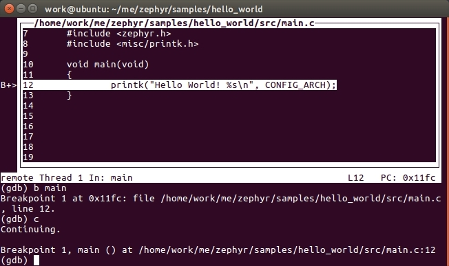
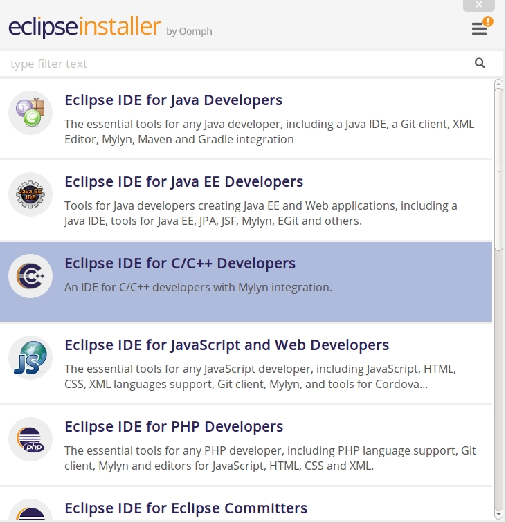
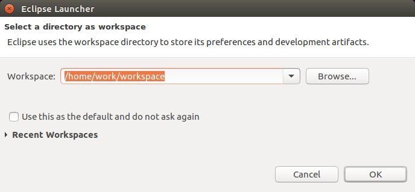
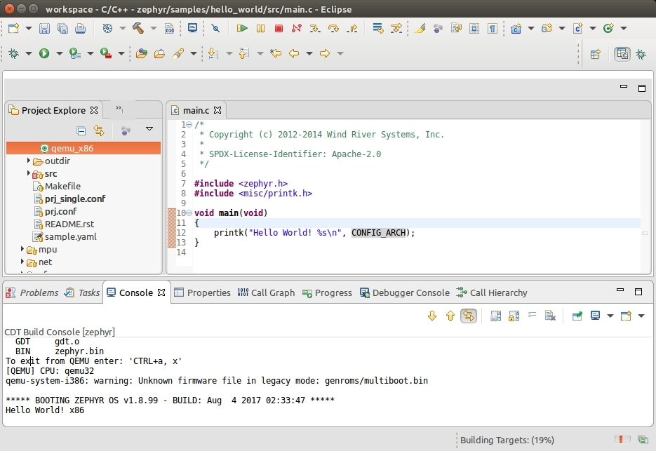
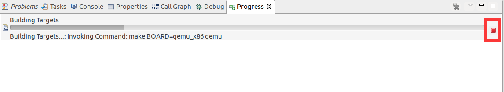
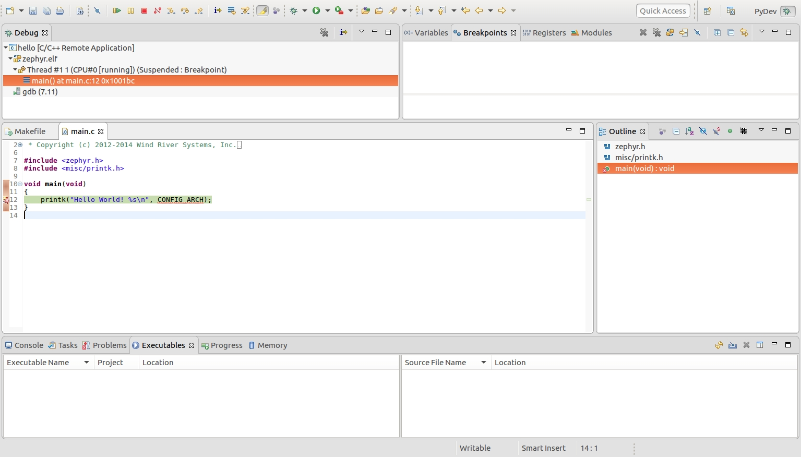

title: QEMU+Eclipse+Ubuntu 进行单步调试
---

> 作者：[tidyjiang8](http://github.com/tidyjiang8/)

由于 qemu 不需要单独的硬件开发板，任何人都可以直接在自己的机器上运行 qemu 进行仿真，所以我们先以 qemu 作为基础，介绍使用 Eclipse 单步调试 zephyr 应用程序程序的一般方法，然后再研究各个开发板的调试方法。

Eclipse 的本质只是一个 UI 界面，我们可以借助 Eclipse 这个外壳来调用通过命令行运行的命令。因此，为了能理解 Eclipse 里面进行编译、调试时发生了什么，我们先用控制台进行编译、调试，了解其基本逻辑，提升一下逼格，然后再使用乾坤大挪移，将整个过程移植到 Eclipse 里面。

# 使用命令行编译

这个过程就不说了，太简单了，总结一下，就 4 个步骤：
```bash
$ cd zephyr
$ source zephyr-env.sh     ### 执行 source 命令 
$ cd samples/hello_world
$ make BOARD=qemu_x86 run  ### 指定需要编译的板子，编译，并使用qemu仿真
```

这个过程的细节将在本文后面的 [编译](#编译) 一节中详细分析。

# 使用命令行调试

先进入 hello_world 目录，然后执行如下的命令，启动 gdb server:
```bash
$ make BOARD=qemu_x86 debugserver
```

然后新打开一个终端，再次进入该目录，然后执行如下命令：
```bash
$ gdb --tui outdir/qemu_x86/zephyr.elf
```

然后会有一个命令行的图形界面，先敲一下回车，会进入如下界面：

<center>


</center>

然后在这个界面里，输入命令：
```bash
target remote localhost:1234
```

然后就可以开始调试了。依次执行命令：
```
b main # 在 main 函数入口出设置断点
c      # 让程序继续运行
n      # 单步执行
```
<center>



</center>

整个过程非常简单，小结一下：先启动 gdbserver，然后启动 gdb client，使用端口 1234 连接这个 gdbserver，然后开始调试。

虽然命令行的这个界面看上去逼格异常高，但是我等屌丝还是更喜欢利用 IDE 来调试，方便很多。

# 安装 Eclipse CDT

Eclipse 依赖于 Java 运行时环境，所以我们在正式开始安装 zephyr 前，先来安装 JDK/JRE。直接使用如下命令即可完成安装：
```bash
$ sudo apt-get install default-jdk
```

Eclipse 现在提供了一个安装器（Installer），通过这个安装器我们可以直接安装任意版本的 Eclipse，非常方便。先从[官网](http://www.eclipse.org/downloads/)下载 Eclipse 安装器。我是直接使用命令行进行下载的：
```
$ wget https://www.eclipse.org/downloads/download.php?file=/oomph/epp/oxygen/R/eclipse-inst-linux64.tar.gz
```
下载完成后，解压该压缩包并执行安装文件 eclipse-inst：

```bash
$ tar xf eclipse-inst-linux64.tar.gz
$ cd eclipse-installer/
$ ./eclipse-inst
```

在弹出的安装界面中选择 Eclipse IDE for C/C++ Developers，然后在新弹出的安装界面设置安装路径，并安装。

<center>



</center>

 然后等待安装完成即可。

# 创建工程

Eclipse 的默认安装目录是 ~/eclipse/cpp-neon/eclipse。进入你的 Eclipse 安装目录，然后启动 Eclipse：
```bash
$ cd ~/eclipse/cpp-neon/eclipse
$ nohup ./eclipse &
```

> 1. 符号 `&` 的作用是让这条命令在后台运行

> 2. `nohup` 的作用是让当前运行的命令脱离当前的 shell 控制台。即使你不小心关闭了当前的控制台，Eclipse 也依然会一直运行。

选择工作空间。
<center>



</center>

关闭欢迎界面。

<center>


</center>

在菜单栏依次选择 File->New->Makefile Project with Existing Code（Ubuntu 有菜单活动时无法截图，所以就未截图了）。

然后在新弹出的界面上点击 Browse 按钮选择 zephyr 源码所在目录，并填好 Project Name，然后点击 Finish。


<center>


</center>

然后工程就创建好了。

# 编译

在开始配置编译环境前，我们先来想想我们是如何在命令行进行编译的：
```bash
$ cd zephyr
$ source zephyr-env.sh     ### 执行 source 命令 
$ cd samples/hello_world
$ make BOARD=qemu_x86 run  ### 指定需要编译的板子，并编译
```

上面这几个步骤，我们主要关注第 2 步和第 4 步。

前面已经说了，Eclipse 的本质只是一个 UI 界面，因此我们可以在这个界面中调用我们上面的命令。对于上面的第 4 条命令，我们在 Eclipse 里面是有办法完成的，但是第 2 条命令的话，暂时还没想到比较好的办法，所以我目前只想到一个不太优雅的做法：

** 执行命令 `source zephyr-env.sh` 的主要作用就是设置一些环境变量，这些环境变量在编译 zephyr 应用程序时会使用到。在 Linux 中，shell 环境变量是有继承关系的，即当某个脚本里有一些环境变量时，从这个脚本中执行的其它脚本（或程序）会自动继承这些环境变量。shell 脚本里的命令是一条一条向下执行的，控制台的命令也是一条一条向下执行的，所以控制台也可以认为是一个 shell 脚本，它里面的环境变量也有继承关系。因此我的做法是：从控制台以命令的方式启动 Eclipse，并在启动这个 Eclipse 前，先执行
`source zephyr-env.sh` 这条命令，这样之后，Eclipse 就拥有这些环境变量了 **。

然后我们开始解决第 4 条命令。对于每个不同的应用程序，我们都需要创建它自己的 target，这里以 hello-world 例程为例。

在 Project Explorer 栏，依次展开 samples/hello-world，选中 hello_world 这个目录，右键，选择 Build Targets -> Crteat，在新弹出的对话框中，填写如下内容：

<center>


</center>

- Target name: 这个可以随便写，只是我们自己看的。
- Build Target: **BOARD=qemu_x86 run**(要把方框中的勾去掉才能修改)
- Build Command: **make**

请注意我上面 **加粗** 的地方，它表示的意思是在 samples/hello_world 目录下面执行命令 `make BOARD=qemu_x86 run`，这就与我们的命令行对接上了。然后点击 OK。

此时我们再看 Project Explorer，发现在 hello_world 目录下多了一点东西：

<center>


</center>

然后我们鼠标双击这个`qemu_x86`这个图标，就会开始编译程序了。可以在 console 窗口中看到编译的输出消息。编译成功后，qemu 会自动运行：

<center>



</center>

但是还有一个坑，我们注意上图中右下角的两个地方，编译进度始终卡在那儿动，这是因为我们在编译时启动了qemu 进行仿真，而系统运行结束后在等待我们输入 "ctrl+a, x" 来终止 qemu。但是事实上，我们没办法在 Eclipse 的控制台上面输入 "ctrl+a, x"，所以我们需要强行终止编译过程。先点击右下角的小方块，然后在新弹出的界面中点击进度条右边的图标，结束编译过程。

<center>



</center>

# 调试

## 配置调试环境
依次在菜单栏中选择 run->debug configuration，然后在弹出的界面中，双击 C/C++ remote Application 新建一个调试项目，并将其命名为 hello-world，然后再选择下面的 Select Other，在新弹出的界面中选择 Manual 这一项，然后保存。

然后按下图所示进行填充。

<center>


</center>

上面的 Debugger 选项卡就是与我们之前的命令行一一对应的。

然后点击 apply 按钮保存(close 和 debug 两个按钮先不要动)。

## 开始调试

理论上，我们现在就可以直接在 Eclipse 里面编译，然后进行 debug 了，但是由于 Eclipse 是单任务的，必须等编译完成后才能进行下一个任务(调试)，而编译时会卡在 qemu 上面，由此造成了死锁，所以我们不得不绕一个弯。我们先直接在终端中执行命令：
```bash
$ make OARD=qemu_x86 debugserver
```

然后再在 Eclipse 里面点击调试按钮进行调试。在弹出的对话框中选择 Proceed 和 Yes 按钮。然后，终于可以了：

<center>



</center>

# 说明

调试启动时默认是停留在 main 函数里面，但是你也可以修改调试配置，让它停留在内核的其它地方。 

</br>